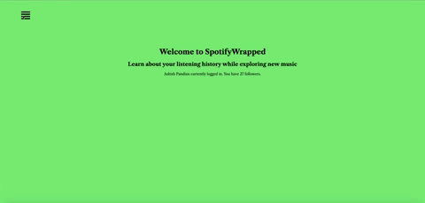

# SpotifyWrapped



> Explore your Spotify listening History
---

### Table of Contents

- [Description](#description)
- [How To Use](#how-to-use)
- [Contributing](#contributing)
- [License](#license)

---

## Description

A project built on flask to let people explore new artists and see their top artists and songs. There are couple other features included in the project such as the song currently playing and new songs out. 


[Back To The Top](#SpotifyWrapped)

---

## How To Use

Changes to file:
<br />
1. Set up a developer account in [Spotify Dashboard](https://developer.spotify.com/dashboard/)
<br />
2. Create an app in the dashboard and get the client ID and the client secret ID over to the data python file at the indicated 'xxxxxxx' portion.
<br />
3.Go to your spotify account and copy your profile link and add the userID below the client and secret id.
<br />
4.Download the dependencies and run the app.

```
# Install dependencies
pip install spotipy
pip install json
```

```
# Run app
python3 server.py
```

---
#### API Reference

Project uses the [Spotipy api](https://spotipy.readthedocs.io/en/2.13.0/) to get the listening history and discover new artists and music.

[Back To The Top](#SpotifyWrapped)


---
## Contributing
Pull requests are welcome. For major changes, please open an issue first to discuss what you would like to change.

Please make sure to update tests as appropriate.

[Back To The Top](#SpotifyWrapped)

---
## License

MIT License

Copyright (c) [2020] [Ashish Pandian]

Permission is hereby granted, free of charge, to any person obtaining a copy
of this software and associated documentation files (the "Software"), to deal
in the Software without restriction, including without limitation the rights
to use, copy, modify, merge, publish, distribute, sublicense, and/or sell
copies of the Software, and to permit persons to whom the Software is
furnished to do so, subject to the following conditions:

The above copyright notice and this permission notice shall be included in all
copies or substantial portions of the Software.

THE SOFTWARE IS PROVIDED "AS IS", WITHOUT WARRANTY OF ANY KIND, EXPRESS OR
IMPLIED, INCLUDING BUT NOT LIMITED TO THE WARRANTIES OF MERCHANTABILITY,
FITNESS FOR A PARTICULAR PURPOSE AND NONINFRINGEMENT. IN NO EVENT SHALL THE
AUTHORS OR COPYRIGHT HOLDERS BE LIABLE FOR ANY CLAIM, DAMAGES OR OTHER
LIABILITY, WHETHER IN AN ACTION OF CONTRACT, TORT OR OTHERWISE, ARISING FROM,
OUT OF OR IN CONNECTION WITH THE SOFTWARE OR THE USE OR OTHER DEALINGS IN THE
SOFTWARE.


[Back To The Top](#SpotifyWrapped)